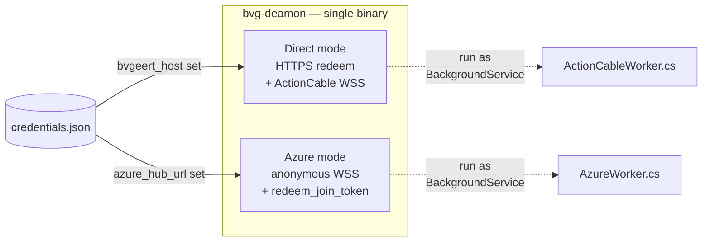
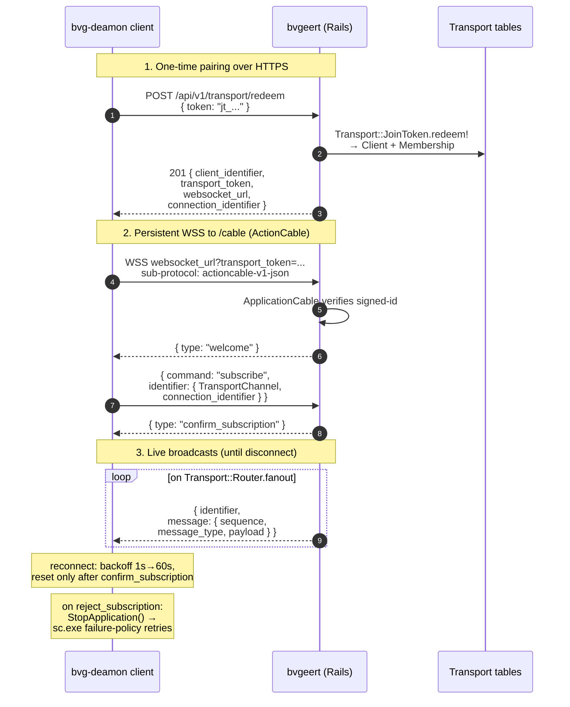
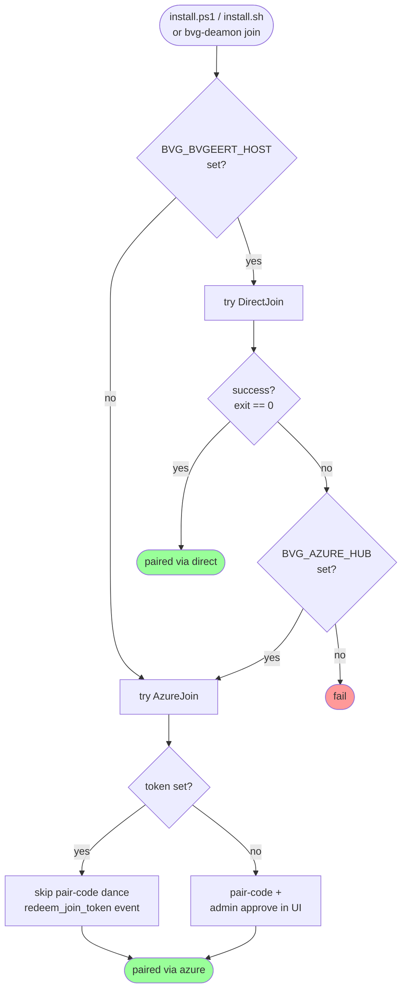
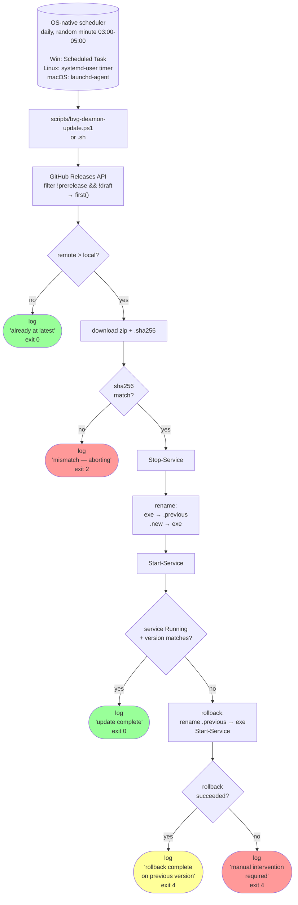

# bvg-deamon — architecture

Hoe de twee routes werken, hoe de mode-switch zit, en hoe self-update intern
loopt. Voor de happy-path "wat moet ik installeren": zie [OPERATIONS.md](OPERATIONS.md).

## Twee modes in één binary



`Credentials.Mode` (C#) en `credentialsMode()` (Node) leiden de modus af uit
welke velden gezet zijn in `credentials.json`:

| Veld gezet | Mode | Wie kiest? |
|---|---|---|
| `bvgeert_host` | direct | `bvg-deamon join --host <h> --token <jt>` |
| `azure_hub_url` | azure | `bvg-deamon join --hub <wss> --transport <t> [--token <jt>]` |

Eén exe, twee BackgroundService-implementaties (`Direct/ActionCableWorker.cs`
en `Azure/AzureWorker.cs`). De Generic Host kiest op `Mode`.

## Direct mode flow



Reconnect: exponential backoff 1s → 60s. Backoff reset alleen na succesvolle
`confirm_subscription` (anders hamert de daemon de server bij elke pre-subscribe
disconnect).

`reject_subscription` (verlopen `transport_token`) → daemon stopt zichzelf via
`IHostApplicationLifetime.StopApplication()`. Windows `sc.exe failure`-policy
probeert het opnieuw; bij blijvende fail moet operator een nieuwe `--token`
draaien via `bvg-deamon join`.

## Azure mode flow

```mermaid
sequenceDiagram
    autonumber
    participant C as bvg-deamon client
    participant A as Azure WebPubSub hub
    participant B as bvgeert (Rails)

    Note over C,A: 1. Anonymous bootstrap
    C->>A: WSS (no userId)
    A->>B: sys.connect webhook
    B-->>A: assign anon-<hex> userId
    A-->>C: connected as anon-xxx

    Note over C,A: 2. Server-side token redeem
    C->>A: send_event "redeem_join_token"<br/>{ token, topic_identifier }
    A->>B: user.event webhook
    B->>B: Transport::JoinToken.redeem!<br/>+ mint access_url (1h JWT)
    B->>A: send_to_connection<br/>{ type: "pairing.approved",<br/>client_id, access_url, expires }
    A-->>C: pairing.approved

    Note over C,A: 3. Reconnect as authenticated client
    C->>A: WSS access_url<br/>(JWT roles: sendToUser + joinLeaveGroup)
    A->>B: sys.connected webhook (userId=cl_…)
    B->>B: create azure_web_pubsub Endpoint<br/>+ Transport::Session

    Note over C,A,B: 4. Live envelopes via Azure send_to_user
    loop on Transport::Router.fanout
        B->>A: AzureWebPubSubServiceClient.send_to_user
        A-->>C: envelope
    end
```

Met `--token`: skip de pair-code-dance (geen `pairing_request_topic`, geen
admin-approve in UI). De server-side webhook handler `handle_redeem_join_token`
maakt direct een `Transport::Client`, mint een 1-uur access-URL, en stuurt
`pairing.approved` terug via Azure.

Refresh: in azure-mode is `access_url` 1 uur geldig. Re-pair vereist nu nog
handmatige `bvg-deamon join`. Een refresh-flow (`request_refresh_token` event)
bestaat al in de Node-implementatie maar is nog niet ge-port naar C# — niet
kritisch want de service-restart-policy zou bij expiry automatisch een
verbinding opnieuw proberen.

## Auto-fallback: direct → azure



De fallback is **alleen op exit-code** van `bvg-deamon.exe join` — er is geen
pre-flight connectivity-check tussen de twee. Een direct-join faalt bij DNS-
failure, TCP-block, HTTP-error, of een ongeldige token. Bij elk van die fail-
condities en gegeven `BVG_AZURE_HUB`, probeert de installer de azure-route met
hetzelfde token.

## Self-update



Versie-detectie: `version.txt` naast de exe (gestamped door release-workflow)
of fallback `bvg-deamon --version` (leest `AssemblyInformationalVersion`).

Stable-only filter: `release.prerelease=false AND release.draft=false`.

Rollback-strategie: voor de exe-swap wordt de huidige `bvg-deamon.exe`
hernoemd naar `.previous`. Als de nieuwe niet start, doet de updater de
omgekeerde rename en herstart de service met de oude versie. Beide rename
ops zijn NTFS-atomic op dezelfde volume — geen tussentijdse "geen exe"-staat.

## File-layout (Windows-service)

```
%ProgramData%\bvg-deamon\
├── bvg-deamon.exe              # 77 MB self-contained .NET 10 binary
├── bvg-deamon.exe.previous     # only present right after a successful update
├── credentials.json            # ACL: SYSTEM full + Administrators read
├── version.txt                 # current version string (e.g. "0.4.1")
├── install.ps1                 # bundled in zip, ran once at install
├── uninstall.ps1               # bundled in zip
├── bvg-deamon-update.ps1       # bundled in zip, ran by Scheduled Task
├── README.txt                  # bundled in zip
└── logs\
    ├── bvg-deamon-YYYYMMDD.log # daemon logs, rolling 10 MB × 5
    └── updater.log             # updater logs, append-only
```

Per-service registry env-var `BVG_DEAMON_CREDENTIALS` wijst de service-context
naar `%ProgramData%\bvg-deamon\credentials.json` (anders zou `LOCALAPPDATA`-
default voor `LocalSystem` `C:\Windows\System32\config\systemprofile\...` zijn).

## File-layout (Unix)

```
/usr/local/bin/bvg-deamon              # wrapper shell-script
/usr/local/lib/bvg-deamon/
├── bvg-deamon.js                       # Node bundle
├── bvg-deamon.js.previous              # post-update fallback
├── bvg-deamon-update.sh                # updater
├── version.txt                         # version stamp
└── node-v22.11.0/bin/node              # only if system Node was missing

~/.config/bvg-deamon/
└── credentials.json                    # mode 0600

~/.local/state/bvg-deamon/
└── updater.log

~/.config/systemd/user/
├── bvg-deamon.service
├── bvg-deamon-update.service
└── bvg-deamon-update.timer
```
