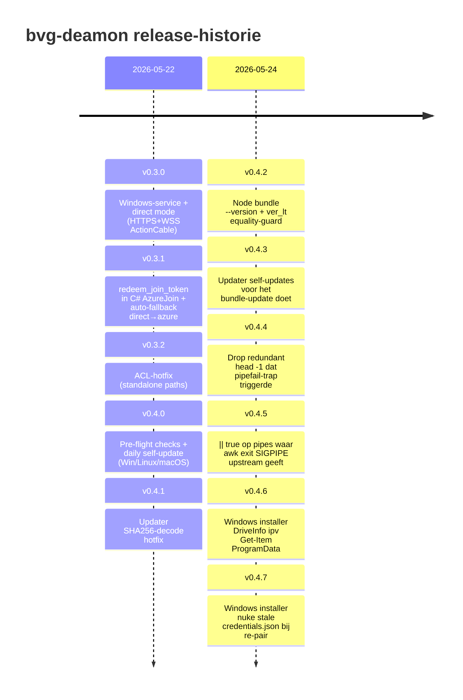

# bvg-deamon — status

Snapshot van wat de client kan, welke versies live zijn, en wat live getest is.
Laatste update bij release v0.4.7 (2026-05-24).

## Release-progressie

## Wat de client doet

`bvg-deamon` is de **transport-client voor het BvGeert-netwerk** — een headless
daemon die op een server, dev-box of klant-machine draait en zich abonneert op
één of meer connections (transports). Hij ontvangt envelopes (`message_type`,
`payload`) van bvgeert en kan ze (in azure-mode) ook terug-sturen.

| Aspect | Detail |
|---|---|
| Platforms | Windows 10+ (x64), Linux (x64/aarch64), macOS (arm64/x64) |
| Windows | self-contained `.NET 10` exe (~77 MB), draait als `Local System` service |
| Linux   | Node bundle ≥ 22, draait via `systemd --user` |
| macOS   | Node bundle ≥ 22, draait via `launchd` LaunchAgent |
| Install | één-regel curl/iwr commando — UAC self-elevate op Windows |
| Routes  | direct (HTTPS + ActionCable WSS) of azure (Azure WebPubSub) — switch op credentials |
| Auto-update | daily via OS-native scheduler met SHA256-verificatie en automatische rollback |
| Auto-fallback | direct → azure bij failure als operator beide envs zet |

## Capabilities per release

| Versie | Wat erbij kwam | Releases |
|---|---|---|
| **v0.3.0** | Windows-service + direct-mode (HTTPS-redeem + ActionCable WSS), single-file exe, installer + uninstaller | [link](https://github.com/appfabriek/bvg-deamon/releases/tag/v0.3.0) |
| **v0.3.1** | `redeem_join_token` in C# Azure-join (parity met Node — server-side auto-pair, skip admin approve). Auto-fallback direct → azure in CmdJoin + install.ps1. | [link](https://github.com/appfabriek/bvg-deamon/releases/tag/v0.3.1) |
| **v0.3.2** | Hotfix: ACL-lockdown alleen op `%ProgramData%`-pad. Eerder werd ook standalone `%LOCALAPPDATA%` credentials.json gelockt → eigen daemon kon 'em niet meer lezen niet-elevated. | [link](https://github.com/appfabriek/bvg-deamon/releases/tag/v0.3.2) |
| **v0.4.0** | Pre-flight checks (OS, disk, internet) en **daily self-update** via Scheduled Task (Win) / systemd-timer (Linux) / launchd-agent (macOS). Stable-only filter, SHA256-verificatie, automatische rollback bij fail-to-start. | [link](https://github.com/appfabriek/bvg-deamon/releases/tag/v0.4.0) |
| **v0.4.1** | Hotfix: updater decodeerde `.sha256` response-body niet (GitHub stuurt `Byte[]`, `.Trim()` throwde). Gevangen door dry-run vóór een klant 'em raakte. | [link](https://github.com/appfabriek/bvg-deamon/releases/tag/v0.4.1) |
| **v0.4.2** | Node bundle had geen `--version` flag → updater interpreteerde elke swap als "verkeerde versie" en rolde altijd terug. Plus `ver_lt 0.4.1 0.4.1` was true (sort -V -C zonder equality-check) → daily updater triggerde elke dag een no-op upgrade-loop. | [link](https://github.com/appfabriek/bvg-deamon/releases/tag/v0.4.2) |
| **v0.4.3** | Updater haalt zichzelf van latest release vóór de eigen logica. Anders blijven oude installs hangen op een buggy updater-script tot iemand handmatig re-installt. | [link](https://github.com/appfabriek/bvg-deamon/releases/tag/v0.4.3) |
| **v0.4.4** | `head -1` na een awk die zelf `print; exit` doet triggert SIGPIPE op upstream → met `set -o pipefail` faalt het script intermitterend stil. `head -1` verwijderd. | [link](https://github.com/appfabriek/bvg-deamon/releases/tag/v0.4.4) |
| **v0.4.5** | awk's eigen `exit` veroorzaakt dezelfde pipefail-trap. `\|\| true` op de twee betreffende pipes; de bestaande empty-check is de echte error-handler. | [link](https://github.com/appfabriek/bvg-deamon/releases/tag/v0.4.5) |
| **v0.4.6** | Windows installer `Get-Item $env:ProgramData` faalt op Win11 26200 — directory-junction quirk. `[System.IO.DriveInfo]::new()` omzeilt de pad-provider. | [link](https://github.com/appfabriek/bvg-deamon/releases/tag/v0.4.6) |
| **v0.4.7** | Windows installer kon stale `credentials.json` niet overschrijven bij re-install — vorige install zet Admins-ACL op Read. Fix: file vooraf verwijderen via directory-ACL. | [link](https://github.com/appfabriek/bvg-deamon/releases/tag/v0.4.7) |

## Live-test bewijzen (op rzdm2 + staging.rozendom.nl)

| Wat | Bewijs |
|---|---|
| Direct route end-to-end | `[#3](https://github.com/appfabriek/bvg-deamon/pull/3)` — service registered as Local System, `sc.exe query` toont `STATE RUNNING`, `Transport::Router.fanout` broadcasts `#3 windows-test` en `#4 live-test.ping` ontvangen ~1s na publish in `%ProgramData%\bvg-deamon\logs\bvg-deamon-*.log` |
| Azure route end-to-end (token-redeem) | `[#4](https://github.com/appfabriek/bvg-deamon/pull/4)` — `bvg-deamon.exe join --hub wss://...azure.com/.../e2e_test --token jt_...` paired client `cl_f1f3b215...`, daemon stdout: `connected — connectionId=... userId=cl_...`, broadcasts `azure-route-test` en `azure-route-test.ping2` (seq=5, seq=6) ontvangen ~1s na publish |
| Self-update detect+download+verify+swap+rollback | `[#6](https://github.com/appfabriek/bvg-deamon/pull/6)` — standalone dry-run tegen v0.4.1 release-zip: log toont `latest stable: 0.4.1`, `update available: 0.0.1 -> 0.4.1`, `sha256 verified (0fcba87663...)`, swap, failed-start (fake service), rollback-trigger met "manual intervention required" log |
| Linux happy-path self-update | 2026-05-24 op rzdm6 (Ubuntu 24.04): fresh install v0.4.1 → trigger updater handmatig → 0.4.1 → 0.4.5 succesvol, geen rollback, service blijft `active`, idempotente re-run `already at latest`. Vijf bugs onderweg gevonden (PR #10 t/m #13). |
| Windows happy-path self-update | 2026-05-24 op rzdm2: in-place upgrade v0.3.0 → v0.4.7 via `install.ps1`-rerun, Scheduled Task aangemaakt, `Start-ScheduledTask bvg-deamon-update` → `already at latest (0.4.7 >= 0.4.7)`. Twee installer-bugs onderweg gefixt (PR #14, #15). |
| Azure-route + restricted-network simulatie | 2026-05-24 op rzdm2: install met alleen `BVG_AZURE_HUB` (geen direct-host), daemon pairt + draait via Azure WebPubSub. Hosts-file blokkade `staging.rozendom.nl` + `bvgeert.{com,nl}` → daemon ontvangt nog steeds broadcasts via Azure én updater bereikt nog steeds GitHub (`querying GitHub Releases API… already at latest`). Bewijst dat daemon- en updater-route onafhankelijk zijn. |

## Nog niet end-to-end getest (geen show-stoppers)

| Wat | Waarom uitgesteld | Risico |
|---|---|---|
| macOS install + update flow | Geen test-machine actief in de sessie waar dit werd gebouwd | Laag — Linux-pad geverifieerd met identieke updater-code; verschil is alleen launchd vs systemd. |
| GitHub-geblokkeerde klant | Vereist een echte machine achter een firewall die ook `github.com` blokt; nu nog niet aangetroffen | Open — workaround zou een eigen update-mirror achter whitelisted domein zijn. |

## Deployment-status op klanten

| Machine | Versie | Modus | Notes |
|---|---|---|---|
| `rzdm2` (Windows 11) | `v0.4.7` (service) | azure | Laatst geïnstalleerd voor azure-mode + restricted-network test. Self-update Scheduled Task draait dagelijks (random in 03:00-05:00). |
| `rzdm6` (Ubuntu 24.04) | `v0.4.5` (systemd-user) | direct | Live-test van Linux install + happy-path self-update. Update timer daily + 1h random delay. Eerstvolgende run brengt 'em naar v0.4.7. |

## Verwante docs

- [ARCHITECTURE.md](ARCHITECTURE.md) — hoe direct/azure/fallback/self-update onder de motorkap werken
- [OPERATIONS.md](OPERATIONS.md) — install, update, troubleshoot, uninstall
- [CHANGELOG.md](../CHANGELOG.md) — release-historie met commit-links
- [CLAUDE.md](../CLAUDE.md) — handoff-guide voor nieuwe Claude-sessies

Server-side perspectief (token issuance, connection-beheer, broadcast-triggers)
staat in de **bvgeert** repo: `docs/operations/transport-clients.md`.
